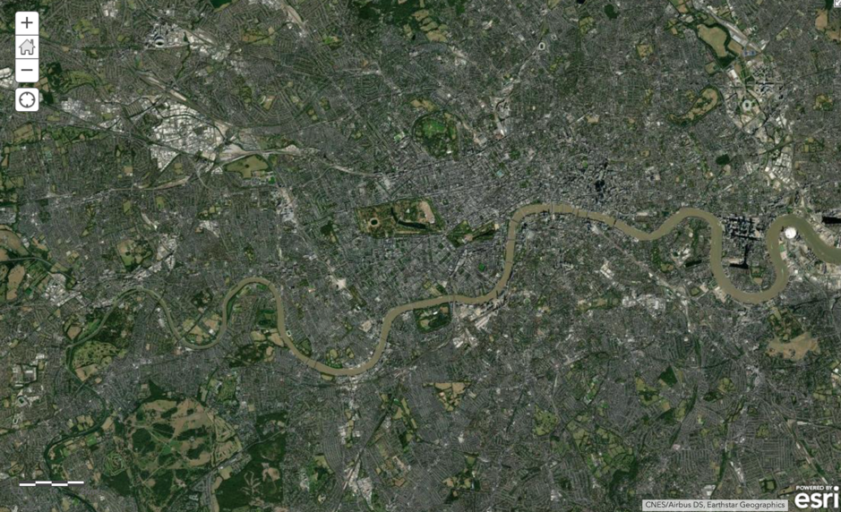
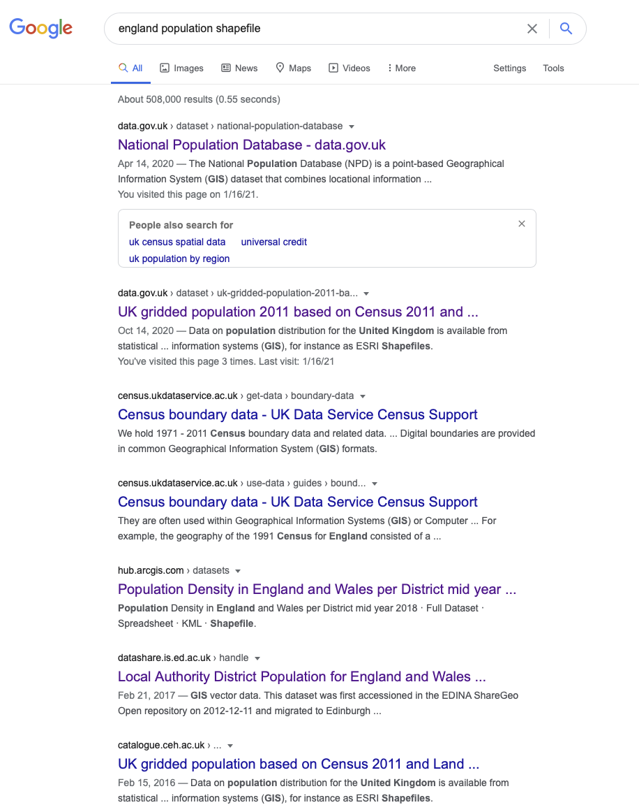

# GIScience and GIS software

This week’s lecture introduced you to foundational concepts associated with GIScience and GIS software on spatial representations and sample design. Out of all our foundational concepts you will come across in the next four weeks, this is probably the most substantial to get to grips with and has both significant theoretical and practical aspects to its learning.

The practical component of the week puts some of these learnings into practice with a digitisation of the river Thames in London as well as an exploration of population data within London using QGIS.

## Lecture recording {#recording-w02}
- Lecture W1

## Reading list {#reading-w02}
- Reading #1
- Reading #2

## Simple digitisation of spatial features
To get spatial features in a digital form, they need to be digitised. Let’s take what should be a straight-forward example of digitising the River Thames in London.

```{r echo=FALSE, fig.align='center', cache=TRUE, fig.cap='The Thames.'}

```

We are going to use a very light online tool that allows us to create digital data and export the data we create as raw files.

1. Head to [geojson.io](http://geojson.io/#map=12/51.5170/-0.1030) - it should load directly, zoomed into London.
2. In the bottom left-hand corner, select **Satellite** as your map option.
3. Next, click on the `Draw a Polyline` tool.
4. Now digitise the river Thames - simply click from a starting point on the left- or right-hand side of the map, and digitise the whole river.
5. Once you are done, simply double-click your final point to end your line.
6. You can then click on the line and select `info` to find out how long the line is. 

#### Questions {-}

- How easy did you find it to digitise the data and what decisions did you make in your own ‘sample scheme’? 
- How close together are your clicks between lines? 
- Did you sacrifice detail over expediency or did you spend perhaps a little too long trying to capture ever small bend in the river? 
- How well do you think your line represents the River Thames?

## Population Change in London
The second part of this practical will introduces you to **attribute joins** and making a simple choropleth map. You will be using these joins throughout this module, so it is incredibly important that you understand how they work – even as simple as they may be!

:::note
**Note**<br/>
The data sets you will create in this practical will be used in next week's practical, so make sure to follow every step and export your data into your working folder at the end.
:::

When using spatial data, there is generally a very specific workflow that you will need to go through - and believe it or not, the majority of this is not actually focused on analysing your data.

Along with the idea that **80% of data is geographic data**, the second most often-quoted GIS-related unreferenced ‘fact’ is that anyone working with spatial data will spend **80% of their time simply finding, retrieving, managing and processing the data** – before any analysis can be done.

One of the reasons behind this need for a substantial amount of processing is that the data you often need to use is not in the format that you require for analysis. For example, for our investigation, there is not a ‘ready-made’ spatial population data set (i.e. population `shapefile`) we can download to explore population change across England:

```{r echo=FALSE, fig.align='center', fig.cap='Alas a quick Google search shows that finding a shapefile of England\'s population is incredibly difficult.'}

```

Instead, we need to go and find the raw data sets and create the data layers that we want. As a result, before beginning any spatial analysis project, it is best-practice to think through what end product you will ultimately need for your analysis.

A typical spatial analysis workflow usually looks something like this:

- **Identify** the data you need to complete your analysis i.e. answer your research questions. This includes thinking through the scale, coverage and currency of your data set.
- **Find** the data that matches your requirements, e.g. *- is it openly and easily available?*
- **Download** the data and **store** it in the correct location.
- **Clean/tidy** the data - this may be done before or after ingesting your data into your chosen software/programme.
- **Ingest/load** the data into your chosen software/programme.
- **Transform & process** the data - this may require *re-projection*, *creating joins* between data sets, *calculating* new fields and/or *creating* selections of the data that you want to work with. 
- **Run Analysis** on your data, whatever technique you are using.
- **Visualise** your data and results, including maps, graphs and statistics.
- **Communicate** your study and outputs - through good write-ups and explanations of your visualisations.

As you can see, the analysis and visualisation part comes quite late in the overall spatial analysis workflow - and instead, the workflow is very top-heavy with data management.

Often in GIS-related courses, you will often be given pre-processed data sets ready to go ahead with analysing the data. Instead, we are going to start cleaning (the majority of) our data from the get-go. 

This will help you understand the processes that you will need to go through in the future as you search for and download your own data, as well as deal with the data first-hand before ingesting it within our GIS software. Good thing you will be learning a lot about these aspects over the coming weeks!

### Setting the scene
For this practical, we will investigate how population has changed over the last ten years in London. Understanding population change - over space - is spatial analysis at its most fundamental. We can understand a lot just from where population is growing or decreasing, including thinking through the impacts of these changes on the provision of housing, education, health and transport infrastructure. 

We can also see first-hand the impact of wider socio-economic processes, such as urbanisation, or, in the case of the predicted population movements currently, relocation of a certain demographic of urban dwellers to rural areas. For us, the aim for our practical is to actually create population data for London in 2011, 2015 and 2019 at the **ward** scale that we can use within our future analysis projects, starting next week. 

This data will be used in our future practicals to **normalise** certain data, such as the crime data sets for next week.

#### Why do we need to normalise by population? {-}
When we record events created by humans, there is often a population bias: simply, more people in an area will by probability lead to a higher occurrence of said event, such as crime. We will look at this in greater detail next week.

### Finding our data sets
In the UK, finding authoritative data on population and Administrative Geography boundaries is increasingly straight-forward. Over the last ten years, the UK government has opened up many of its data sets as part of an Open Data precedent that began in 2010 with the creation of [data.gov.uk](data.gov.uk) and the Open Government Licence (the terms and conditions for using data).

[Data.gov.uk](www.data.gov.uk) is the UK government’s central database that contains open data that the central government, local authorities and public bodies publish. This includes, for example, aggregated census and health data – and even government spending. In addition to this central database, there are other authoritative databases run by the government and/or respective public bodies that contain either a specific type of data (e.g. census data, crime data) or a specific collection of data sets (e.g. health data direct from the NHS, data about London). Some portals are less up-to-date than others, so it is wise to double-check with the ‘originators’ of the data to see if there are more recent versions.

For our practical, we will access data from two portals:

1. For our administrative boundaries, we will download the **spatial** data from the *London Datastore* (which is exactly what it sounds like!).
2. For population, we will download **attribute** data from the *Office of National Statistics (ONS)* for 2019 and the London Datastore (currently only contains these data until 2018).

### Downloading and processing
The first step in our practical is to download and process our two main data sets: *administrative geography boundaries* and *population data*.

#### Administrative Geography Boundaries 
For our administrative boundaries, we will download the *Statistical GIS Boundary Files for London* data set(s) found in the London Datastore.

1. Navigate to the data sets: [[Link]](https://data.london.gov.uk/dataset/statistical-gis-boundary-files-london) 

When you navigate to this page, you will find multiple choices of data to download. 

2. We will need to download all three zipfiles: `statistical-gis-boundaries-london.zip`, `London-wards-2014.zip` and `London-wards-2018.zip`.

The first data set contains **ALL** levels of London’s administrative boundaries. In descending size order: Borough, Ward, Middle layer Super Output Area (MSOA), Lower layer Super Output Area (LSOA), and Output Area (OA) from 2011. The second data set contains an *UPDATED* version of the Ward boundaries, as of 2014. The third data set contains an *UPDATED* version of the Ward boundaries, as of 2018. Once downloaded, you will need to unzip the file.

:::note
**Note** <br/>
To unzip the file, you can use the built-in functionality of your computer’s operating system. For Windows: right click on the zip file, select Extract All, and then follow the instructions. For Mac OS: double-click the zip file.
:::

As we will be looking at population data for 2015 and 2019, it is best practice to use those boundaries that are most reflective of the ‘geography’ at the time; therefore, we will use these 2014 / 2018 ward boundaries for our 2015 / 2019 population data set, respectively. 

Once unzipped, you will find two folder options: *Esri* and *MapInfo.* These folders contain the **same set of data**, but simply in two data formats: **Esri shapefile** and **MapInfo TAB**.

:::note
**Note**<br/>
MapInfo is another proprietary GIS software, which has historically been used in public sectors services in the UK and abroad (and many councils still use the software!), although has generally been replaced by either Esri’s ecosystem or open-source software GIS. The TAB format is the main format that the software uses for vector data, similar to Esri and its shapefile format.
:::

3. In your `GEOG0030/data/raw/` folder, create a new folder called `boundaries`. Within this folder, create three new folders: `2011`, `2014` and `2018`.
4. Copy the entire contents of `Esri` folder of each year into their respective year folder within your new `boundaries` folder. We **do not** want to add the additional `Esri` folder as a step in our filesystem, i.e. your file path should read: `GEOG0030/data/raw/boundaries/2011` for the 2011 boundaries and `GEOG0030/data/raw/boundaries/2014` for the 2014 boundaries etc.

```{r echo=FALSE, fig.align='center', fig.cap='Your setup should look like this.'}
knitr::include_graphics('images/w02/w2files.png')
```

5. We now have our Administrative Geography files ready for use. We will ingest these directly into QGIS and do not need to do any cleaning at this stage.

:::note
**Note** <br/>
Administrative geographies are a way of dividing the country into smaller sub-divisions or areas that correspond with the area of responsibility of local authorities and government bodies. 

These administrative sub-divisions and their associated geography have several important uses, including assigning electoral constituencies, defining jurisdiction of courts, planning public healthcare provision, as well as what we are concerned with: used as a mechanism for collecting census data and assigning the resulting data sets to a specific administrative unit. 

Administrative areas ensure that each public body has a clearly defined area of responsibility, which can be measured and budgeted for appropriately. 
They originate from the Roman era who used these geographies, usually defined by topographical and geographical features, to administer these regions including collecting the relevant tax from those living in these areas. 

These geographies are updated as populations evolve and as a result, the boundaries of the administrative geographies are subject to either periodic or occasional change. For any country in which you are using administrative geographies, it is good practice therefore to research into their history and how they have changed over the period of your data set. 

In the modern spatial analysis, we use administrative geographies to aggregate individual level data and individual event data. One of the motivations for this is the fact that census data (and many other sources of socio-economic and public health data) are provided at specific administrative levels, whilst other data sets can often be easily geo-referenced or aggregated to these levels. Furthermore, administrative geographies are concerned with the hierarchy of areas – hence we are able to conduct analyses at a variety of scales to understand local and global trends.

The UK has quite a complex administrative geography, particularly due to having several countries within one overriding administration and then multiple ways of dividing the countries according to specific applications. 

For the majority of your practicals, we will be keeping it simple with a focus on London, which is divided into:

* **Boroughs** -> **Wards**

OR 

* **Boroughs** -> **Middle layer Super Output Areas** -> **Lower layer Super Output Areas** -> **Output Areas**. 

We will be looking at wards in our practical analysis – although even at this fine scale, the City of London is a little pesky and introduces complexities into our analysis, which we willl see.
:::

#### Population data 
For our population data sets, we will use the ONS mid-year estimates (MYE). These population data sets are **estimates** that have been modelled based on the previous 2011 census count and then forecasted population growth (in combination with several additional data sources). They are released once a year, with a delay of a year. Today we will use the data for 2011, 2015, and 2019.

As the London Datastore only has these MYE for up to 2018, we will download some more recent data from ONS directly. *It is always worth checking the ‘originators’ of the data to see if there are more recent versions.*

1. Navigate to the **Ward** level data sets: [[Link]](https://www.ons.gov.uk/peoplepopulationandcommunity/populationandmigration/populationestimates/datasets/wardlevelmidyearpopulationestimatesexperimental)
2. When you navigate to this page, you will find multiple choices of data to download. We will need to download the estimates for **2011, 2015 and 2019**. Click to download each of the zipfiles. Choose the **revised** versions for 2015 and the (Census-based) 2011 wards edition for 2011. 

3. In your `GEOG0030/data/raw/` folder, create a new folder called `population`, unzip your download, and copy the three spreadsheets into this folder.

Now it is time to do some quite **extensive** data cleaning. 

#### Cleaning our population data sets
If you open up the 2011 ward spreadsheet in Excel (or another spreadsheet programme: this could be Numbers or you can upload your data to use it with Google Docs, for example), you will quickly see that there are several worksheets to this workbook. **We are interested in the Mid-2011 Persons.**

1. Click on the **Mid-2011 Persons** tab and have a look at the data. 

As you should be able to see, we have a set of different fields (e.g. Ward Code, Ward Name), including population statistics. Right now, we have too much data - so what we will want to do is simplify and extract only the data we need for analysis. For this, we need the total population (**All Ages**), alongside some identifying information that distinguishes each record from one another. Here we can see that both **Ward Code** and **Ward Name** suit this requirement. We can also think that the **Local Authority** column might be of use - so it might be worthwhile keeping this information as well.

2. Create a new spreadsheet within your programme. From the **Mid-2011 Persons** spreadsheet, copy over all cells from columns **A** to **D** and rows **4 to 636** into this new spreadsheet. **Row 636** denotes the end of the **Greater London** wards (i.e. the end of the Westminster LA) which are kept (in most scenarios) at the top of the spreadsheet as their **Ward Codes** are the first in sequential order. 
3. Before we go any further, we need to format our data. First, we want to rename our fields to remove the spaces and superscript formatting. Re-title the fields as follows: **ward_code**, **ward_name**, **local_authority** and **POP2011**. 

One further bit of formatting that you **MUST** do before saving your data is to format our population field. At the moment, you will see that there are commas separating the **thousands** within our values. If we leave this **commas** in our values, QGIS will read them as decimal points, creating decimal values of our population. There are many points at which we could solve this issue, but the easiest point is now - we will strip our population values of the commas and set them to integer (whole numbers) values. 

4. To format this column, select the entire column and right-click on the `D` cell.  Click on **Format Cells** and set the Cells to **Number** with **0** decimal places. You should see that the commas are now removed from your population values.
5. Save your spreadsheet into your **working** folder as `ward_population_2011.csv`.

We now need to copy over the data from the 2015 and 2019 data sets into their own `csv's` as well. 

6. Open the **Mid-2015 ward population** `.xls` from your population folder. 

As you will see again, there are plenty of worksheets available - again, we want to select the **Mid-2015 Persons** tab. We now need to copy over the data from our 2015 data set to a new spreadsheet again. However,  at first instance, you will notice that the City of London (CoL) wards are missing from this data set. Then if you scroll to the end of the London Local Authorities, i.e. to the bottom of Westminster, what you should notice is that the final row for the Westminster data is in fact row 575 - this means we are missing nearly other LAs in addition to our CoL LAs and we will need to determine which ones are missing and if we can find them in the 2015 spreadsheet.

6. With this in mind, **first copy from row 5 to the end of the grouped London Local Authorities**, i.e. to the bottom of Westminster, for columns `A` to `D` into a new spreadsheet. Through a quick scroll through the Local Authorities, a.k.a Boroughs, (and with the extensive knowledge that you will soon build about London Local Authorities!) we can quickly find that we are missing the wards for: 

- *Hackney*
- *Kensington and Chelsea*
- *Tower Hamlets*

If we head back to the original 2015 raw data set, we can actually find this data (as well as the City of London) further down in the spreadsheet. It seems like these LAs had their codes revised in the 2014 revision and are no longer in the same order as the 2011 data set - oh, the joys of using data!

7. Locate the data for the *City of London*, *Hackney*, *Kensington and Chelsea* and *Tower Hamlets* and copy this over into our new spreadsheet. Double-check that you now have in total **637** wards within your data set.

8. Remember to rename the fields as above, but change your population field to **POP2015**. Also, remember to reformat your population values.

9. Once complete, save your spreadsheet into your **working** folder as `ward_population_2015.csv`.

We now need to repeat this for our 2019 data. 

10. Open the **Mid-2019 ward population** spreadsheet from your population folder.

As you will see again, there are plenty of worksheets available - again, we want to select the **Mid-2019 Persons** tab. Let us have a look at our data - once again, there's a lot to take in - but what we're interested is in columns `A`, `B`, and now `D` and `G`. Let us follow the same process we used above to copy our data across.

11. To make our processing easier, first hide columns C, E and F in our spreadsheet - in Excel: right-click on the columns and select *Hide*.

12. Next, copy the data from row 5 to the final row for the Westminster data for columns `A`, `B`, `D` and `G` over into a new spreadsheet.

Look at the total number of rows you have copied over. We can see that we have even fewer wards than the 2015 data set - yikes!We need to go hunting again for our missing data in the 2019 data set. 

For expediency, you need to find and copy over the data for: 

- *City of London*
- *Hackney*
- *Kensington and Chelsea*
- *Tower Hamlets* (as per 2015) 

**and** 

- *Bexley*
- *Croydon*
- *Redbridge* 
- *Southwark*

Perhaps now you see why so much time is spent on processing data for spatial analysis!

13. Copy over the remaining wards for these Local Authorities/Boroughs.

14. Once you've copied them over - you should now have **640** wards - **delete columns `C`, `E` and `F`** and **rename** the remaining fields as you have done previously. Also, remember to **reformat** your population values.

15. Once complete, save your spreadsheet into your `working` folder as `ward_population_2019.csv`.

You should now have your three population `csv` data sets in your `working` folder. We are now (finally) ready to start using our data within QGIS.

### Using QGIS to map our population data
We will now use QGIS to create population maps for the wards in London across our three time periods. To achieve this, we need to **join our table data to our spatial data sets** and then map our populations for our visual analysis. 

Because, as we have seen above, we have issues with the number of wards and changes in boundaries across our three years, we will not (for now) complete any quantitative analysis of these population changes - this would require significant additional processing that we do not have time for today. 

:::note
**Note** <br/>
Data interoperability is a key issue that you will face in spatial analysis, particularly when it comes to Administrative Geographies. 
:::

1. Start **QGIS**.
Let's start a new project.
2. Click on **Project** -> **New**. Save your project into your `qgis` folder as `w2-pop-analysis`. Remember to save your work throughout the practical. 
4. Before we get started with adding data, we will first set the Coordinate Reference System of our Project. Click on **Project** -> **Properties -- CRS**. In the Filter box, type **British National Grid**. Select **OSGB 1936 / British National Grid - EPSG:27700** and click Apply. Click OK.

:::note
**Note**<br/>
We will explain CRSs and using CRSs in GIS software in more detail next week.
:::
    
We will first focus on loading and joining the 2011 data sets. 

5. Click on **Layer** -> **Add Layer** -> **Add Vector Layer**.

6. With **File** select as your source type, click on the small three dots button and navigate to your 2011 boundary files.

7. Here, we will select the `London_Ward.shp` data set. Click on the `.shp` file of this data set and click **Open**. Then click Add. You may need to close the box after adding the layer.

We can take a moment just to look at our Ward data - and recognise the shape of London. Can you see the City of London in the data set? It has the smallest wards in the entire London area. With the data set loaded, we can now explore it in a little more detail. We want to check out two things about our data: first, its **Properties** and secondly, its **Attribute Table**. 

8. Right-click on the `London_Ward` layer and open the **Attribute Table** and look at how the attributes are stored and presented in the table. Explore the different buttons in the Attribute Table and see if you can figure out what they mean. Once done, close the Attribute Table.
9. Right-click on the `London_Ward` layer and select `Properties`. Click through the different tabs and see what they contain. Keep the `Properties` box open.

Before adding our population data, we can make a quick map of the wards in London - we can add **labels** and change the **symbolisation** of our wards.

10. In the `Properties` box, click on the `Symbology` tab - this is where we can change how our data layer looks. For example, here we can change the line and fill colour of our Wards utilising either the default options available or clicking on **Simple Fill** and changing these properties directly. Keep the overall **styling** to a **Single Symbol** for now - we will get back to this once we have added the population data. You can also click on the `Labels` tab - and set the Labels option to `Single labels`. 

11. QGIS will default to the **NAME** column within our data. You can change the properties of these labels using the options available. We will add a small buffer to our labels and change the font to **Futura** and size **8**. You can click **Apply** to see what your labels look like.

```{r echo=FALSE, fig.align='center', fig.cap='It looks incredibly busy.'}
knitr::include_graphics('images/w02/wardlabels.png')
```

12. Click **OK** once you are done changing the Symbology and Label style of your data to return to the main window. 

:::note
**Note**<br/>
**Turning layers on/off & drawing orders**<br>
The main strength of a GUI GIS system is that is really helps us understand how we can visualise spatial data. Even with just these two shapefiles loaded, we can understand two key concepts of using spatial data within GIS.

The first, and this is only really relevant to GUI GIS systems, is that each layer can either be turned on or off, to make it visible or not (try clicking the tick box to the left of each layer). This is probably a feature you are used to working with if you have played with interactive web mapping applications before!

The second concept is the order in which your layers are drawn – and this is relevant for both GUI GIS and when using plotting libraries such as ggplot2 in RStudio. Your layers will be drawn depending on the order in which your layers are either tabled (as in a GUI GIS) or ‘called’ in your function in code.

Being aware of this need for 'order' is important when we shift to using RStudio and `ggoplot2` to plot our maps, as if you do not layer your data correctly in your code, your map will end up not looking as you hoped!

For us using QGIS right now, the layers will be drawn from bottom to top. At the moment, we only have one layer loaded, so we do not need to worry about our order right now - but as we add in our 2015 and 2018 ward files, it is useful to know about this order as we will need to display them individually to export them at the end.
:::

#### Conducting an attribute join
We are now going to join our 2011 population data to our 2011 shapefile. First, we need to add the 2011 population data to our project. 

13. Click on **Layer** -> **Add Layer** -> **Add Delimited Text Layer**.

14. Click on the three dots button again and navigate to your **2011 population data** in your `working` folder. Your file format should be set to `csv`. You should have the following boxes clicked: *Decimal separator is comma; First record has field names' Detect field types; Discard empty fields*. QGIS does many of these by default, but do double-check!

15. Set the Geometry to *No geometry (attribute only table)*. Then click **Add** and **Close***. You should now see a table added to your `Layers` box.

We can now join this table data to our spatial data using an **Attribute Join**.

:::note
**Note**<br>
An attribute join is one of two types of data joins you will use in spatial analysis (the other is a spatial join, which we will look at later on in the module). An attribute join essentially allows you to join two data sets together, as long as they share a common attribute to facilitate the ‘matching’ of rows:

```{r echo=FALSE, fig.align='center', fig.caps='Figure from Esri documentation on Attribute Joins.'}
knitr::include_graphics('images/w02/attribute_joins.png')
```

Essentially you need a **single identifying ID** field for your records within both data sets: this can be a code, a name or any other string of information. In spatial analysis, we always **join our table data to our shape data** (One way to think about it as putting the table data into each shape). 

As a result, your target layer is always the shapefile (or spatial data) whereas your join layer is the table data. These are known as the left- and right-side tables when working with code. 

**To make a join work, you need to make sure your ID field is correct across both data sets**, i.e. no typos or spelling mistakes. Computers can only follow instructions, so they do not know that *St. Thomas* in one data set is that same as *St Thomas* in another, or even *Saint Thomas*! It will be looking for an exact match! 

As a result, whilst in our data sets we have kept both the name and code for both the boundary data and the population data, **when creating the join, we will always prefer to use the CODE over their names**. Unlike names, codes reduce the likelihood of error and mismatch because they do not rely on understanding spelling! 

Common errors, such as adding in spaces or using `0` instead `O` (and vice versa) can still happen – but it is less likely. 
:::

To make our join work, we need to check that we have a matching **UID** across both our data sets. We therefore need to look at the tables of both data sets and check what attributes we have that could be used for this possible match.

16. Open up the Attribute Tables of each layer and check what fields we have that could be used for the join. We can see that both our respective `*_Code` fields have the same codes so we can use these to create our joins.

17. Right-click on your `London_Ward` layer -> **Properties** and then click on the **Joins** tab. 
- Click on the **+** button.Make sure the **Join Layer** is set to `ward_population_2011`.
- Set the **Join field** to `ward_code`.
- Set the **Target field** to `GSS_code`.
- Click the `Joined Fields` box and click to only select the `POP2011` field.
- Click on the **Custom Field Name Prefix** and **remove** the pre-entered text to leave it blank.
- Click on **OK**.
- Click on **Apply** in the main Join tab and then click OK to return to the main QGIS window.

We can now check to see if our join has worked by opening up our `London_Ward` **Attribute Table** and looking to see if our wards now have a **Population** field attached to it:

18. Right-click on the `London_Ward` layer and open the **Attribute Table** and check that the population data column has been added to the table.

As long as it has joined, you can move forward with the next steps. If your join has not worked, try the steps again - and if you are still struggling, do let us know.

:::note
**Note**<br />
Now, the join that you have created between your ward and population data sets in only held in QGIS's memory. If you were to close the programme now, you would lose this join and have to repeat it the next time you opened QGIS. To prevent this from happening, we need to export our data set to a new shapefile - and then re-add this to the map.
:::

Let's do this now:

19. Right-click on your `London_Ward` shapefile and click **Export** -> **Save Vector Layer as..**. The format should be set to an ESRI shapefile.
- Then click on the three dots buttons and navigate to your `final` folder and enter: `ward_population_2011` as your file name.
- Check that the **CRS** is **British National Grid**.
- Leave the remaining fields as selected, but check that the **Add saved file to map** is checked.
- Click **OK**.

You should now see our new shapefile add itself to our map. You can now remove the original `London_Ward` and `ward_population_2011` data sets from our Layers box (**Right-click on the layers** -> **Remove Layer**).

The final thing we would like to do with this data set is to style our data set by our newly added population field to show population distribution around London.

20. To do this, again right-click on the **Layer** -> **Properties** -> **Symbology**.
- This time, we want to style our data using a **Graduated** symbology.
- Change this option in the tab and then choose `POP2011` as your column. 
- We can then change the color ramp to suit our aesthetic preferences - *Viridis* seems to be the cool colour scheme at the moment, and we will choose to invert our ramp as well. 
- The final thing we need to do is **classify** our data - what this simply means is to decide how to group the values in our data set together to create the graduated representation. 
- We will be looking at this in later weeks, but for now, we will use the **Natural Breaks** option. 
- Click on the drop-down next to Mode, select **Natural Breaks**, change it to **7** classes and then click **Classify**.
- Finally click **Apply** to style your data set.

:::note
**Note**<br/>
Understanding what classification is appropriate to visualise your data is an important step within spatial analysis and visualisation, and something you will learn more about in the following weeks. Overall, they should be determined by understanding your data's distribution and match your visualisation accordingly.

Feel free to explore using the different options with your data set at the moment – the results are almost instantaneous using QGIS, which makes it a good playground to see how certain parameters or settings can change your output.
:::

You should now be looking at something like this:

```{r echo=FALSE, fig.align='center', fig.cap='Your result.'}
knitr::include_graphics('images/w02/ward_2011.png')
```

You will be able to see that we have **some** missing data - and this is for several wards within the City of London.  This is because census data is **only recorded for 8 out of the 25 wards** and therefore we have **no data** for the remaining wards. As a result, these wards are left blank, i.e. white, to represent a **NODATA** value. 

One thing to flag is that **NODATA** means no data - whereas 0, particularly in a scenario like this, would be an actual numeric value. It iss important to remember this when processing and visualising data, to make sure you do not represent a **NODATA** value incorrectly.

#### Conducting an attribute join for 2014/2015 and 2018/2019
You now need to **repeat this whole process** for your 2015 and 2019 data sets. Remember, you need to:

- Load the respective Ward data set as a Vector Layer.
- Load the respective Population data set as a Delimited Text File Layer (remember the settings!).
- Join the two data sets together using the Join tool in the Ward data set Properties box.
- Export your joined data set into a new data set within your `final` folder.
* Style your data appropriately.

To make visual comparisons against our three data sets, theoretically we would need to standardise the breaks at which our classification schemes are set at. This can be a little fiddly with QGIS, so for now, you can leave your symbolisation to the default settings.

Alternatively, to set all three data sets to the same breaks, you can do the following:

- Right-click on the `ward_population_2019` data set and navigate to the `Symbology` tab. Double-click on the Values for the smallest classification group and set the Lower value to 141 (this is the lowest figure across our data sets, found in the 2015 data). Click OK, then Click Apply, then Click OK to return to the main QGIS screen.
-  Right-click again on the `ward_population_2019` data set but this time, click on **Styles** -> **Copy Styles** -> **Symbology**.
- Now right-click on the `ward_population_2015` file, but this time after clicking on **Styles** -> **Paste Style** -> **Symbology**. You should now see the classification breaks in the 2015 data set change to match those in the 2019 data.
- Repeat this for the 2011 data set as well.
- The final thing you need to do is to now change the classification column in the `Symbology` tab for the 2015 and 2011 data sets back to their original columns and press **Apply**. You will see when you first load up their Symbology options this is set to *POP2019*, which of course does not exist within this data set.

#### Exporting our maps for visual analysis

To export each of your maps (as is):
- Click on **Project** -> **Import/Export** -> **Export to Image** and save your final map in your `maps` folder. You may want to create a folder for these maps titled `w02`.

Next week, we will look at how to style our maps using the main map conventions (adding North Arrows, Scale Bars and Legends) but for now a simple picture will do. To get a picture of each of your different layers, remember to turn on and off each layer (using the check box).

Finally, remember to save your project!


## Before you leave {#byl-w02}
[That is it for this week](https://www.youtube.com/watch?v=Wmc8bQoL-J0)!
